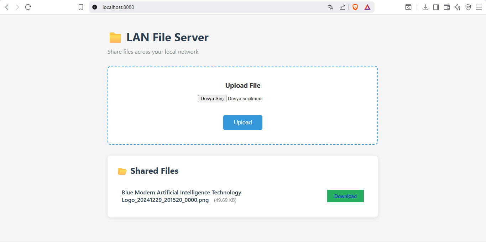

# LAN File Server

A lightweight, dependency-free file sharing server for local networks. 
Built with Go's standard library — no external packages required.

## Screenshot



## Features

- 📁 **File Upload** — Drag and drop via web interface
- 📥 **File Download** — Direct links with proper headers
- 🔒 **Security** — Path traversal protection, size limits
- 📱 **Cross-Device** — Share between phone, tablet, laptop on same WiFi
- ⚡ **Zero Dependencies** — Only Go standard library

## Usage

```bash
# Clone and run
git clone https://github.com/yasinngulerr/lan-file-server.git
cd lan-file-server

# Create uploads directory
mkdir uploads

# Run server
go run main.go

# Or build executable
go build -o lan-server main.go
./lan-server